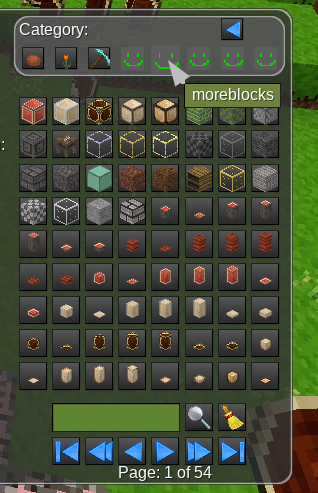

# AutoInvCat

Automatic inventory categories,  
creates a inventory tab for every mod with many nodes (e.g. moreblocks)
nodes from mods with few nodes are collected in one tab.

## interaction with unified_inventory
AutoInvCat uses sorting numbers from 100 to 127 for the automatically created inventory tabs.
The order is the alphabetical order of the mod name

## How to install:
The whole project is the mod.
Put the project folder into the Mods Directory of Minetest.

### How to find the Mods Directory?
Minetest > About > Open User Data Directory > Mods

## TODO:
- also categorze items
- category icons?
    - use icon provided by mod?
    - use 1 char of mod name in pixel icon?

## licens:
Copyright (C) 2022 MatzE, licens: Creative Commons BY-SA 4.0
